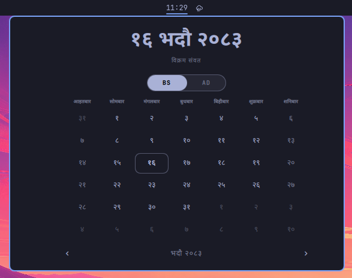

# lun.patro

A bar-widget plugin for [Omarchy](https://omarchy.org) that shows a date/time label in the bar with a calendar popup — cloned from the built-in `omarchy.clock` plugin and extended with Nepali Bikram Sambat (BS) date support.



## Files

| File                     | Purpose                                                                                                               |
| ------------------------ | --------------------------------------------------------------------------------------------------------------------- |
| `manifest.json`          | Plugin manifest — id, version, `bar-widget` kind, entry point, and the `showNepali` / `calendarMode` settings schema. |
| `BarWidget.qml`          | The bar entry point: renders the date/time label, handles click behavior, and hosts the calendar popup panel.         |
| `Panel.qml`              | The calendar popup shown when the widget is clicked.                                                                  |
| `Model.js`               | Date formatting and Bikram Sambat conversion logic.                                                                   |
| `THIRD_PARTY_NOTICES.md` | Attribution for the BS calendar data used by `Model.js`.                                                              |

## Installation

Bar-widget plugins live under `~/.config/omarchy/plugins/<plugin-id>/` and are picked up by `omarchy-shell`.

**Option 1 — via the Omarchy plugin CLI (recommended)**

```bash
omarchy plugin add https://github.com/sudiplun/lun.patro.git --enable
```

You'll be asked to confirm, since plugins run as unsandboxed code inside your shell session. Omit `--enable` to install without turning it on immediately.

**Option 2 — manual install**

```bash
git clone https://github.com/sudiplun/lun.patro.git ~/.config/omarchy/plugins/lun.patro
omarchy-shell shell rescanPlugins
omarchy plugin enable lun.patro
```

## Remove

```sh
omarchy plugin remove lun.patro

```

## Configuration

Set these through the widget's settings UI, or directly in `shell.json` under this widget's entry:

| Key                         | Type    | Default                        | Description                                                                             |
| --------------------------- | ------- | ------------------------------ | --------------------------------------------------------------------------------------- |
| `showNepali`                | boolean | `false`                        | Show the Nepali BS date in the bar instead of the standard format.                      |
| `calendarMode`              | string  | `"bs"`                         | Calendar used for the popup/date display: `"bs"` (Bikram Sambat) or `"ad"` (Gregorian). |
| `format` / `verticalFormat` | string  | inherited from `omarchy.clock` | Date/time format string cycled with right-click, same as the stock clock widget.        |

## Credits

- Based on Omarchy's built-in `omarchy.clock` widget (see the `omarchy.clonedFrom` field in `manifest.json`).
- Bikram Sambat month-length data (2070–2090 BS) is from [medic/bikram-sambat](https://github.com/medic/bikram-sambat), licensed under the Apache License 2.0 — see `THIRD_PARTY_NOTICES.md`.

## Author

[sudiplun](https://github.com/sudiplun)
